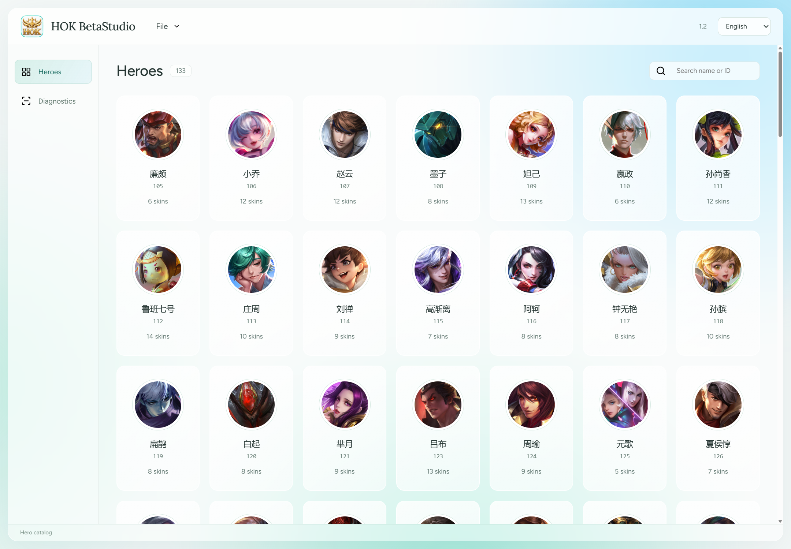
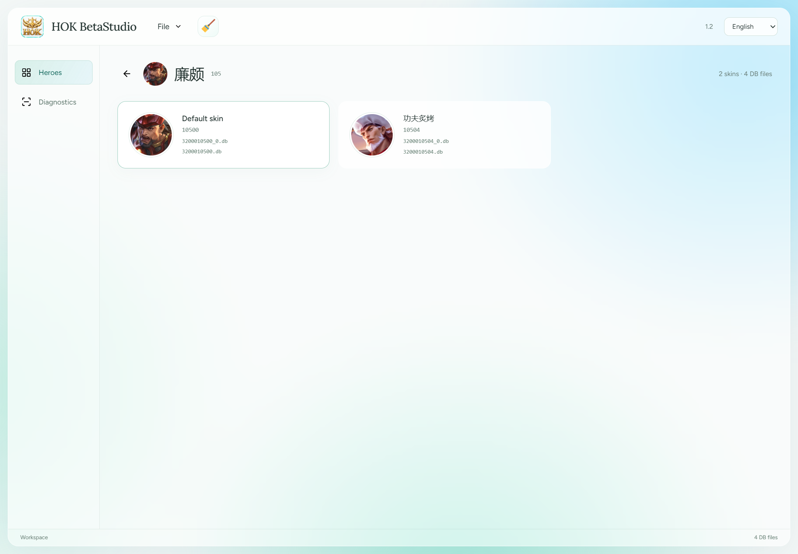
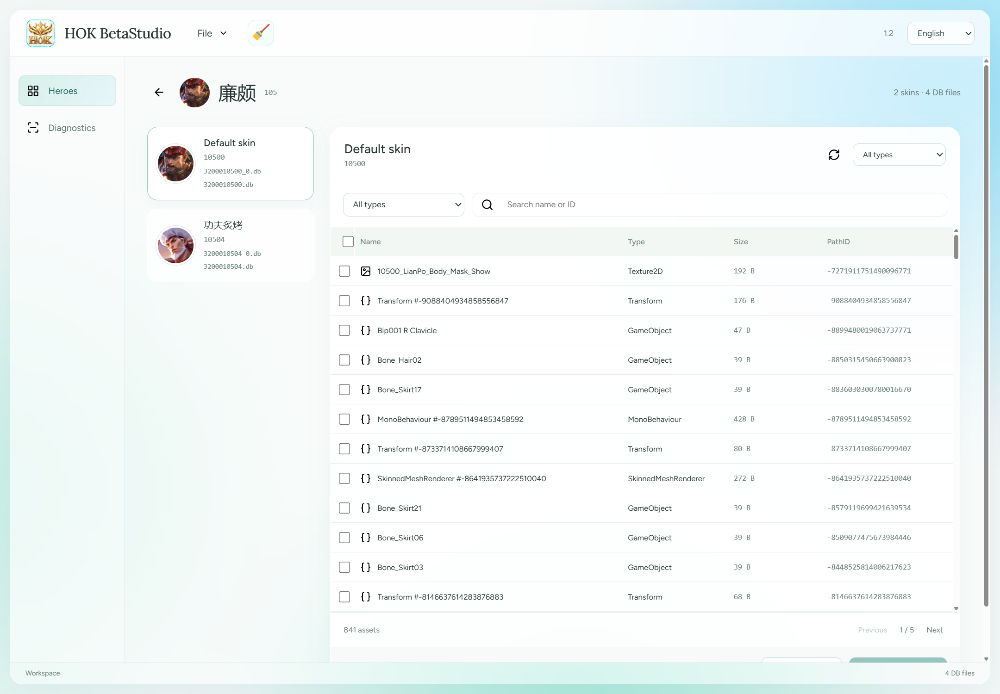
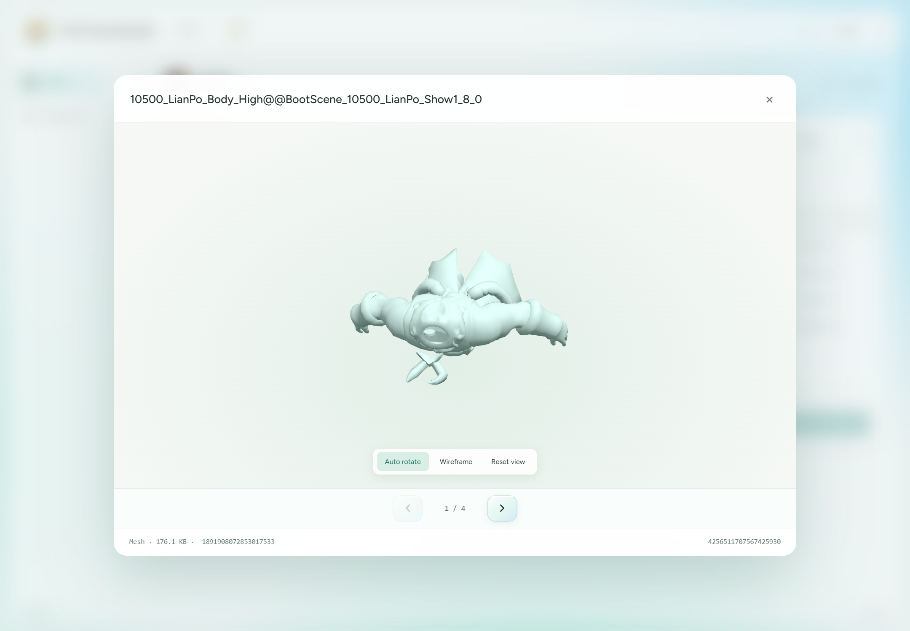
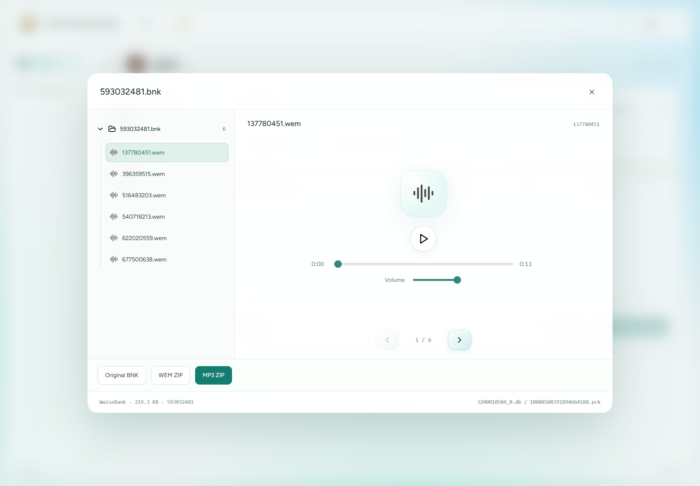
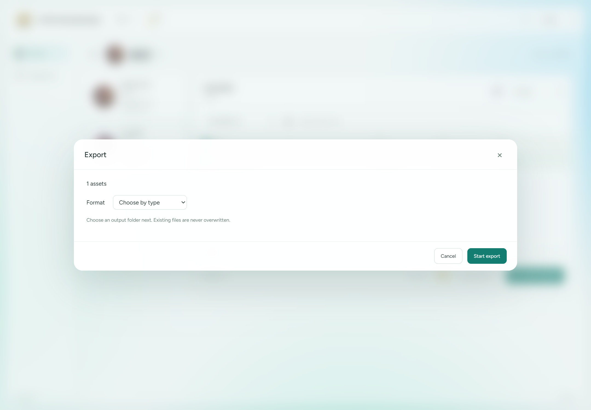

<div align="center">
  
  <h1>HOK BetaStudio</h1>
  <p>Không gian làm việc trên máy tính cho tài nguyên Honor of Kings.</p>
  <p>
    
    
    
    
    
  </p>
</div>

<!-- README-I18N:START -->

[English](./README.md) | [简体中文](./README.zh.md) | **Tiếng Việt**

<!-- README-I18N:END -->

Phiên bản **1.3** bổ sung [đồng bộ tài nguyên ngầm](docs/RESOURCE-SYNC-1.3.md) và đã có trên [trang Release 1.3](https://github.com/Alanshown/HOK-BetaStudio/releases/tag/1.3). Xem [ghi chú phát hành](docs/releases/1.3/RELEASE-NOTES.md).

**[Tải bộ cài 1.3](https://github.com/Alanshown/HOK-BetaStudio/releases/download/1.3/HOK-BetaStudio-1.3-win-x64-setup.exe) · [Tải ZIP portable 1.3](https://github.com/Alanshown/HOK-BetaStudio/releases/download/1.3/HOK-BetaStudio-1.3-win-x64-portable.zip)**

Windows x64 · Mã nguồn phiên bản 1.3 · [Cài đặt và kiểm tra](docs/INSTALL.md#tiếng-việt) · [Giấy phép MIT](LICENSE)

Duyệt gói DB theo tướng và trang phục, kiểm tra dữ liệu Unity lẫn dữ liệu khác, xem mô hình, nghe âm thanh và xuất hàng loạt. Backend C# tách việc phân tích, xem trước và xuất khỏi tiến trình giao diện.

**[Ảnh chụp](#export) · [Bản phát hành](https://github.com/Alanshown/HOK-BetaStudio/releases/tag/1.3) · [Báo lỗi](https://github.com/Alanshown/HOK-BetaStudio/issues)**



## Mục lục

- [Không gian làm việc và quét tệp](#workspace)
- [Xem trước và xuất](#export)
- [Thay thế và đóng gói lại — Beta](#beta)
- [Cấu trúc dự án](#structure)
- [Biên dịch và đóng gói](#build)
- [Tải xuống và sử dụng](#download)
- [Kiểm chứng](#verification)
- [Ghi công và phân phối](#attribution)

<a id="workspace"></a>
## Không gian làm việc và quét tệp

- **Duyệt trước khi nhập.** Danh mục cục bộ hiển thị tướng và trang phục khi khởi động. Thẻ xuất hiện theo hiệu ứng domino chéo và tôn trọng tùy chọn giảm chuyển động của hệ thống.
- **Đồng bộ tài nguyên (1.3).** Ảnh được tải từ URL HTTPS trong chỉ mục. Khi khởi động, ứng dụng đọc chỉ mục cục bộ đang áp dụng rồi âm thầm tải và kiểm tra danh mục chính thức. Chỉ khi xác nhận có khác biệt mới hiện nút **Đồng bộ tài nguyên** có hiệu ứng. Áp dụng cập nhật sẽ xóa bộ nhớ đệm DB đã nhập và thay thế đang chờ, trở về danh mục tướng rồi làm mới ảnh theo hiệu ứng domino chéo. DB gốc và tệp đã xuất được giữ nguyên; lỗi mạng không thay đổi chỉ mục đang dùng.
- **Mở tệp, thư mục hoặc kéo thả.** Quét đệ quy các thư mục con thông thường, không giới hạn độ sâu cố định. Bỏ qua junction và liên kết tượng trưng để tránh vòng lặp; báo lỗi khi không có quyền truy cập.
- **Đối chiếu theo tên.** `3200010504.db` → trang phục `10504` → tướng `105`. Hậu tố phân mảnh như `_0` được xử lý riêng. DB không có phần mở rộng phải vượt qua kiểm tra chữ ký.
- **Trang phục mặc định.** ID kết thúc bằng `00`, như `10500`, dùng ảnh tướng và nhãn trang phục mặc định. ID tướng hoặc trang phục chưa biết vẫn hiển thị với ảnh thay thế ổn định theo ID.
- **Phạm vi đã nhập.** Sau khi nhập, chỉ hiển thị tướng và trang phục tương ứng cùng tên DB nguồn. Tìm theo tên hoặc ID, lọc loại tài nguyên, phân trang và chọn hàng loạt.
- **Đổi không gian làm việc.** Lần nhập mới xóa bộ nhớ đệm và các thay thế đang chờ của lần trước. Nút chổi có hiệu ứng xóa bộ nhớ đệm và trở về danh mục ban đầu, không xóa tệp gốc.
- **Ba ngôn ngữ giao diện:** tiếng Anh, tiếng Trung giản thể và tiếng Việt. Giữ nguyên tên tài nguyên và tên trong danh mục.



<a id="export"></a>
## Xem trước và xuất

| Mô-đun | Xem trước / đầu ra |
|---|---|
| Texture và sprite | Xem ảnh, bật/tắt kênh và thu phóng; PNG, TGA, BMP, JPG, dữ liệu thô |
| Mesh | Xoay/thu phóng 3D, tự xoay và khung dây; OBJ, JSON, dữ liệu thô |
| GameObject / Animator | Xuất FBX khi có thư viện native và tham chiếu cần thiết |
| AnimationClip | Unity YAML `.anim`, JSON, dữ liệu thô; không chuyển mọi hoạt ảnh độc lập sang FBX |
| AudioClip / âm thanh Wwise | Phát cục bộ; tệp gốc, WAV và MP3 khi bộ giải mã hỗ trợ |
| WwiseBank | Cây phương tiện nhúng và trình phát; BNK gốc, ZIP chứa WEM gốc, ZIP chứa MP3 đã chuyển đổi |
| Văn bản, shader, phông chữ, video | Nội dung gốc hoặc văn bản phù hợp; JSON và dữ liệu thô khi được hỗ trợ |
| Mục khác trong gói | Liệt kê cả dữ liệu không phải Unity; có thể giữ dữ liệu chưa nhận dạng hoặc chưa giải mã ở dạng thô |

Hộp xem trước làm mờ nền, có nút trước/sau trong cùng loại tài nguyên. Điều hướng BNK chỉ chuyển trong bank hiện tại. Thao tác của người dùng dừng tự xoay mô hình.

`WwiseAudio` và `WwiseBank` là loại phương tiện/vùng chứa, **không cố định tương ứng với “âm thanh trò chuyện” và “giọng kỹ năng”**. Bank có thể chứa phương tiện nhúng, tham chiếu ngoài hoặc cả hai. Chỉ dữ liệu thực sự có mặt mới trích xuất được. Xuất WEM giữ nguyên byte gốc; chưa hỗ trợ mã hóa âm thanh bất kỳ thành WEM.

Xuất hàng loạt ghi kết quả từng mục và tránh trùng tên đầu ra. Phân tích, xem trước và xuất dùng các tiến trình worker riêng có quản lý. Lỗi codec và mục không hỗ trợ được thông báo, không bị coi là chuyển đổi thành công.






<a id="beta"></a>
## Thay thế và đóng gói lại — Beta

> [!WARNING]
> **Tính năng thử nghiệm, không khuyến nghị dùng thông thường. Chưa xác minh tương thích trong game.** Di chuột hoặc đặt tiêu điểm lên nhãn Beta để đọc cảnh báo. Đọc lại thành công bằng công cụ không chứng minh game sẽ chấp nhận gói.

1. Chọn đúng một tài nguyên được hỗ trợ để hiện **Thay thế**.
2. Chọn tệp nhị phân gốc tương thích. Mục thay thế thành công được đánh dấu; có thể thay tiếp mục khác hoặc cùng mục đó.
3. Có ít nhất một thay thế đang chờ thì nút **Đóng gói lại** xuất hiện.
4. Chọn thư mục đầu ra riêng. Gói mới chứa nội dung thay thế và toàn bộ tệp gốc còn lại; không ghi đè gói nguồn.

Hiện chỉ thay thế nhị phân có cùng độ dài và vừa ô nén sẵn có; không nhập PNG/OBJ/MP3 tùy ý, thêm đối tượng bất kỳ hay đổi kích thước đối tượng. Chưa hỗ trợ thay thế tổng quát đối tượng không rõ cấu trúc và phương tiện bên trong BNK. Xem trước/xuất thông thường vẫn dùng dữ liệu gốc cho tới khi nhập lại gói đã xây dựng.

Khối sửa đổi có thể dùng Zstd với phần đệm khung có thể bỏ qua. Trường kiểm tra QTS chưa rõ và ánh xạ `record.bytes` **không được tính lại**. Tham chiếu ngoài chỉ có GUID chưa được giải quyết đầy đủ. Sao chép không sửa đổi, bảo toàn byte không đổi và đọc lại mục chỉ là kiểm tra nền, không bảo đảm tương thích game.

<a id="structure"></a>
## Cấu trúc dự án

```text
HOK-BetaStudio/
├── backend/
│   ├── Hok.Desktop/          # C# WPF + WebView2 host
│   ├── Hok.Worker/           # parsing, preview, export
│   ├── Hok.Catalog/          # remote index validation, staging and atomic sync
│   ├── Hok.Contracts/        # filename identity and recursive scanner
│   ├── Hok.Legacy/           # adapters to Studio-HoK readers
│   ├── Hok.Rebuild/          # experimental replacement and rebuild
│   └── *.Tests/             # executable regression suites
├── frontend/                # React + TypeScript + Three.js
├── vendor/Studio-HoK/        # upstream C# source and attribution
├── assets/                  # UI assets, catalog and license notices
├── docs/                    # documentation and real screenshots
├── tooling/                 # build, packaging and verification scripts
├── README.md
├── README.zh.md
└── README.vi.md
```

Không đưa bộ nhớ đệm phụ thuộc, gói runtime native, DB game, tài nguyên xuất và sản phẩm biên dịch vào quản lý nguồn. Bản 1.3 dùng chỉ mục URL đi kèm và ảnh trực tuyến; không còn yêu cầu hoặc đóng gói thư viện ảnh game tĩnh. ID chưa biết và ảnh tải lỗi dùng ảnh thay thế cục bộ.

<a id="build"></a>
## Biên dịch và đóng gói

Ứng dụng desktop cần Windows x64, .NET 10 SDK, Node.js kèm npm và Microsoft Edge WebView2 Runtime. Đóng gói bộ cài cần thêm NSIS. Phiên bản phụ thuộc JavaScript được ghi trong lockfile.

```powershell
git clone https://github.com/Alanshown/HOK-BetaStudio.git
cd HOK-BetaStudio
npm ci --prefix frontend
npm ci --prefix tooling
dotnet build backend/Hok.Desktop/Hok.Desktop.csproj -c Release
dotnet build backend/Hok.Worker/Hok.Worker.csproj -c Release
dotnet run --project backend/Hok.Contracts.Tests -c Release -- .
dotnet run --project backend/Hok.Catalog.Tests -c Release -- .
```

Biên dịch mã nguồn và tạo bản phân phối desktop đầy đủ là hai bước riêng. Xem [đầu vào xây dựng](docs/BUILD.md) về thư viện FBX/FMOD/codec native, công cụ âm thanh, hình ảnh và bố cục đóng gói. Không chép tệp nhị phân bên thứ ba vào Git.

```powershell
powershell -ExecutionPolicy Bypass -File tooling/build-desktop.ps1 -OutputDirectory build/HOK-BetaStudio-1.3-win-x64
powershell -ExecutionPolicy Bypass -File tooling/package-desktop.ps1 -BuildDirectory build/HOK-BetaStudio-1.3-win-x64
```

Trang trình diễn được duy trì riêng và không nằm trong kho này. Các hình ở trên là ảnh chụp ứng dụng desktop thực tế.

Dành cho người duy trì: [hướng dẫn PowerShell về commit, nhánh, push và hợp nhất PR (tiếng Trung)](docs/GIT-PR-GUIDE.zh.md).

<a id="download"></a>
## Tải xuống và sử dụng

Chọn bộ cài Setup hoặc ZIP portable của phiên bản thực sự đã được đăng trên [trang Release](https://github.com/Alanshown/HOK-BetaStudio/releases/tag/1.3). Cập nhật mã nguồn không tự phát hành tệp nhị phân. Tệp **Source code** do GitHub tạo không phải ứng dụng chạy được. Xem [cài đặt, kiểm tra SHA-256 và khắc phục sự cố](docs/INSTALL.md#tiếng-việt).

Giải nén **toàn bộ ZIP portable** rồi chạy `HOK BetaStudio.exe`, hoặc dùng bộ cài Windows. Không tách EXE khỏi các thư mục `worker`, `ui`, `assets`. Gói .NET self-contained vẫn cần [Microsoft Edge WebView2 Runtime](https://developer.microsoft.com/en-us/microsoft-edge/webview2/#download); Setup không tự cài runtime này. Hiện các gói chưa được ký mã.

Mở thư mục chứa đầy đủ DB chính, các mảnh và tệp liên quan. Chọn tướng, trang phục, tài nguyên rồi xem trước hoặc xuất. Luôn sao lưu gói gốc, đặc biệt khi thử đóng gói lại Beta.

<a id="verification"></a>
## Kiểm chứng

Ảnh chụp từ ứng dụng desktop đã đóng gói, dùng mẫu cục bộ `3200010500` và `3200010504`, không phải dữ liệu giao diện bịa đặt. Không công khai mẫu DB, âm thanh hay mô hình được trích xuất.

| Kiểm tra | Kết quả quan sát |
|---|---|
| Chỉ mục / đồng bộ desktop (1.3) | 41 kiểm tra chỉ mục và 22 kiểm tra desktop; ảnh CDN thật, phát hiện ngầm, xóa bộ nhớ đệm, ba ngôn ngữ và làm mới domino |
| Nhận dạng và quét đệ quy | 27 kiểm tra; tìm đủ 14 DB/mảnh qua 12 cấp thư mục |
| Đóng gói lại không sửa đổi | 16 kiểm tra trên hai gói; đầu ra nền giống từng byte |
| Worker thay thế | 15 kiểm tra, gồm thay lại cùng mục và bảo toàn byte không đổi |
| Giao diện thay thế | 11 kiểm tra, gồm chọn đơn và cảnh báo Beta đa ngôn ngữ |
| Worker / desktop BNK | 8 / 9 kiểm tra; xác minh sáu mục phương tiện nhúng trong bank mẫu |

Đây là kết quả hồi quy trong phạm vi mẫu, không khẳng định hỗ trợ mọi phiên bản game hay codec. Một số script tích hợp cần thư mục mẫu riêng và báo cáo sinh cục bộ. Đọc [đầu vào xây dựng](docs/BUILD.md) trước khi chạy.

<a id="attribution"></a>
## Ghi công và phân phối

Mã gốc của HOK BetaStudio được cấp phép theo [MIT](LICENSE). Dựa trên bộ đọc Studio-HoK / AssetStudio; giữ [thông báo MIT thượng nguồn](vendor/Studio-HoK/LICENSE). Giấy phép này không cấp phép lại mã bên thứ ba, tệp nhị phân, hình ảnh game hay nhãn hiệu. Xem [phạm vi giấy phép](docs/LICENSING.md), [thông báo tài nguyên](assets/licenses/SOURCES.txt) và [thông báo âm thanh](assets/licenses/media/NOTICE.txt).

Biểu tượng huy hiệu kèm chữ HOK là ý tưởng tạo cho dự án, không phải logo game chính thức. Tên Honor of Kings, nhân vật, hình ảnh và nhãn hiệu thuộc chủ sở hữu tương ứng; đây là dự án độc lập. Ảnh chụp minh họa công cụ không cấp quyền phân phối lại nội dung game trong ảnh.

Chỉ xử lý tài nguyên bạn được phép sử dụng. Việc công khai không chứng minh đã hoàn tất kiểm tra phân phối: quyền hình ảnh, quyền phân phối FBX/FMOD/codec native và nghĩa vụ mã nguồn tương ứng của FFmpeg vẫn chưa được xác minh trong [danh sách kiểm tra phát hành](docs/RELEASE-CHECKLIST.md). Kho này không cấp giấy phép chung cho các thành phần đó.
